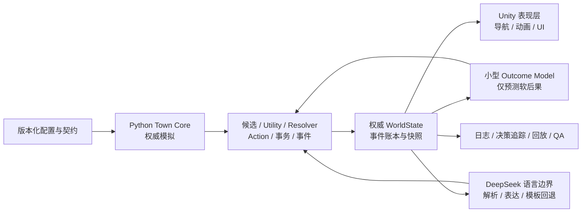

# Small Town World Model

> 小镇世界模型，简称 **STWM**

[](https://github.com/Aringarosaph/small_town_world_model_demo-unity-/actions/workflows/python-ci.yml)
[](LICENSE)
[](pyproject.toml)
[](unity/ProjectSettings/ProjectVersion.txt)

Small Town World Model 是一个使用 **Python + Unity** 构建的小型社会世界模型实验项目。项目希望在有限角色、有限地点、有限行为和有限计算预算下，做出一个可以持续运行、可解释、可回放，并能产生跨角色社会后果的小镇。

它不是依赖大语言模型即兴生成一切的沙盒，也不是试图复刻《模拟人生》的内容规模。核心思路是：

- Python 规则系统持有唯一权威世界状态；
- Unity 负责场景、导航、动画、交互和可视化；
- 小型神经模型只预测受约束的社会软后果；
- DeepSeek 只负责玩家语言的结构化解析和自然语言表达；
- 所有关键决策、事件和状态变化都可以追踪、检查和重放。

当前仓库正在开发 **V0 Demo**。M0 契约基线、M1 Headless 单 NPC 垂直切片和
M2 Unity Bridge 功能灰盒切片均已完成并通过验收。M3 已正式启动，当前目标是
完成 10 NPC、22 行为、家庭经济、有限社交与事件知识传播，并通过多 seed 的
7 日与 30 日规则 Soak。M4 神经训练和 M5 DeepSeek 仍未启动。

## 目录

- [项目要验证什么](#项目要验证什么)
- [系统架构](#系统架构)
- [V0 固定内容](#v0-固定内容)
- [当前进度](#当前进度)
- [快速开始](#快速开始)
- [常用命令](#常用命令)
- [仓库结构](#仓库结构)
- [V0 开发路线](#v0-开发路线)
- [V0 之后的长期计划](#v0-之后的长期计划)
- [开发与治理原则](#开发与治理原则)
- [环境规划](#环境规划)
- [命名与兼容说明](#命名与兼容说明)
- [许可证](#许可证)

## 项目要验证什么

V0 主要回答以下问题：

1. 在只有 10 名 NPC、22 种行为和 8 个地点的前提下，能否形成稳定而可读的生活与社会循环？
2. 能否把家庭资源、工作日程、需求、情绪、关系和事件传播统一进一个确定性的权威模拟？
3. 能否把原本需要大模型判断的有限社会反应蒸馏进小模型，让运行时不依赖大量 API 调用？
4. 小模型参与决策时，能否始终受规则候选、输出范围和权威事务约束？
5. 玩家能否通过自然语言了解和影响角色的主观状态，同时不能直接改写客观世界？
6. 整条社会事件链能否在 Headless、Unity 和回放系统中被解释与复现？

这里的“世界模型”不是让模型自主发现现实社会规律。V0 的学习目标是把经过规则生成、教师模型建议和人工审核的有限社会反应蒸馏为低成本 Outcome Model，再观察这些局部反应在长期规则演化中会产生怎样的组合现象和玩法。

## 系统架构



### 权威边界

| 模块 | 可以做什么 | 不可以做什么 |
| --- | --- | --- |
| Python Town Core | 修改权威状态、结算资源、创建事件、验证事务 | 把状态权威交给 Unity 或模型 |
| Unity | 导航、动画、输入、可视化、回报表现结果 | 直接修改需求、关系、资金或事件 |
| Outcome Model | 在固定候选中预测需求、情绪、关系、接受率和事件概率 | 创造行为、修改硬规则、直接提交状态 |
| DeepSeek | 把玩家文本解析为结构化意图；把 SpeechPlan 表达为自然语言 | 编造未知事实、绕过权限、直接改变世界 |
| QA / Replay | 验证确定性、记录证据、复现失败 | 为通过测试而制造另一套产品规则 |

长期不变的原则是：**规则负责真实，模型负责有限预测，语言负责表达，Unity 负责表现。**

## V0 固定内容

M0 已冻结以下内容规模：

| 内容 | V0 数量或范围 |
| --- | --- |
| NPC | 10 名成年 NPC |
| Household | 4 个家庭单元 |
| 高层地点 | 8 个：4 个住宅、咖啡馆/酒吧、商店、工坊、公园 |
| 高层行为 | 22 种 |
| 交互对象类型 | 15 种 |
| 需求 | hunger、energy、hygiene、fun、social |
| 人格 | sociability、discipline、frugality、irritability |
| 情绪 | valence、stress |
| 有向关系 | familiarity、affinity、trust、tension |
| 经济 | 家庭共享整数资金与食品；固定工资和价格 |
| 权威感知 | V0 只认高层地点共处 |
| 关系预测方向 | 只预测 Target -> Actor 的关系变化 |
| Unity 版本 | `6000.4.2f1` |
| Python 版本 | `3.12.x` |
| 冻结配置目录的来源协议版本 | `0.1.0` |
| M2 在线协商协议版本 | `0.2.0` |
| M3 在线协商协议版本 | `0.3.0` |

22 种行为覆盖基本生活、工作、消费、休闲和有限社会互动。V0 不允许模型自由创造新行为。

## 当前进度

| 里程碑 | 状态 | 结果 |
| --- | --- | --- |
| M0 规范与仓库基线 | 已完成 | 配置、Schema、协议、CI、冻结清单和 Unity 目录骨架 |
| M1 Headless 硬规则切片 | 已完成 | 单 NPC 四行为、三日确定性运行、权威日志与事务回放 |
| M2 Unity Bridge 切片 | 已完成 | 单 NPC 功能灰盒“家 -> 工作 -> 家”、取消、失败、重连与全量重同步 |
| M3 完整规则小社会 | 进行中 | 10 NPC、22 行为、经济与事件传播、30 日规则 Soak |
| M4 社会锚点与世界模型 | 未开始 | 云端训练小型社会 Outcome Model，本地 CPU 推理 |
| M5 DeepSeek 玩家对话 | 未开始 | 有权限边界的解析、表达、异步与模板回退 |
| M6 黄金链与展示版 | 未开始 | 两日社会事件链、Unity 预设、自动回放与发布验收 |

M0 的公开 `main` 已通过：

- 28 个 Python 测试；
- 58 项严格 M0 诊断；
- Ruff lint 与 format；
- Mypy；
- 配置交叉引用验证；
- JSON Schema 和协议示例漂移检查；
- GitHub Actions 的 QA baseline 与 M0 readiness gate。

M1 在此基础上新增并通过：

- 64 项 Python 测试、15 项严格 M1 黑盒诊断、Ruff 与严格 Mypy；
- `npc_01` 从游戏分钟 0 连续运行到 4320；
- baseline、同 seed 重复、7 分钟 chunk、60 分钟 chunk 四组运行等价；
- Idle、Sleep、EatAtHome、WorkShift 四种行为均由 Utility 自然选出；
- 正常上班、宽限期内迟到完成、缺勤不发薪三种班次结果；
- 决策、Action、事务、事件四类权威日志联合哈希；
- 从初始快照和有序事务回放到完全相同的最终状态哈希；
- 非法版本、负资源、需求越界、重叠 Action 和事件篡改拒绝检查。

M2 在本机固定环境中新增并通过：

- Unity `6000.4.2f1` EditMode `26/26`、PlayMode `4/4`，均无跳过；
- 真实 `ClientWebSocket` 与 Python `/town` 服务完成协议 `0.2.0` 的 hello、
  registry、全量 snapshot 和 ready；
- Python 单元测试 `123` 项、集成测试 `7` 项；
- M0 `58/58`、M1 `15/15`、M2 `19/19` 严格诊断；
- M2 的 26 条允许 warning 仅描述 M3 才会补齐的其余地点、NPC 和对象类型；
- Ruff lint/format 与 strict Mypy 全部通过。
- GitHub Actions 运行 `30749456317` 的 QA、M0、M1、M2 四个串行作业全部通过。

## 快速开始

### 1. 前置环境

- Git；
- Python `3.12.x`；
- [uv](https://docs.astral.sh/uv/)；
- Unity `6000.4.2f1`（M0/M1 的纯 Headless 工作不需要启动 Unity）。

macOS 可用 Homebrew 安装 uv：

```bash
brew install uv
```

### 2. 克隆仓库

```bash
git clone https://github.com/Aringarosaph/small_town_world_model_demo-unity-.git
cd small_town_world_model_demo-unity-
```

### 3. 安装 Python 环境

```bash
uv sync --extra test
```

当前维护仓库位于 macOS iCloud 目录。该目录中的隐藏 `.venv` 可能让 Python 3.12.11 跳过 editable install 的 `.pth` 文件，因此本机维护环境使用：

```bash
uv sync --extra test --no-editable
```

之后的本机命令同样附加 `--no-editable`。普通非 iCloud clone 通常可以使用 uv 默认的 editable 模式。

### 4. 验证配置

```bash
uv run --no-editable python -m town_core.cli \
  validate-config --config config/v0
```

成功时输出类似：

```json
{
  "config_version": "v0",
  "counts": {
    "behaviors": 22,
    "households": 4,
    "locations": 8,
    "npcs": 10,
    "object_types": 15
  },
  "protocol_version": "0.1.0",
  "schema_version": "v0.1",
  "valid": true
}
```

这里的 `protocol_version: 0.1.0` 是 `config/v0` 冻结目录的来源版本，不能
替代在线连接协商结果；M2 Bridge 的活动会话只协商 `0.2.0`。

### 5. 运行完整仓库验收

```bash
uv run --no-editable pytest
uv run --no-editable ruff check .
uv run --no-editable ruff format --check .
uv run --no-editable mypy
uv run --no-editable python tools/diagnostics/check_m0.py
uv run --no-editable python tools/diagnostics/check_m1.py \
  --output-root /tmp/stwm-m1-qa --require-sim
```

## 常用命令

### 重新生成并检查协议 Schema

```bash
uv run --no-editable python -m town_core.domain.schema_artifacts \
  --output protocol
uv run --no-editable pytest python/tests/contracts/test_protocol_artifacts.py
```

生成器会更新 `protocol/jsonschema/`、`protocol/examples/` 和版本文件。修改冻结契约前必须先通过 ADR 与版本审查，不能把生成命令当作无条件覆盖工具。

### M1 Headless 与回放

M1 提供以下稳定命令接口：

```bash
# 运行固定 NPC 的三日 Headless 切片
uv run --no-editable python -m town_core.cli run-headless \
  --config config/v0 --agent npc_01 --days 3 --seed 12345

# 重放某次运行并验证最终状态哈希
uv run --no-editable python -m town_core.cli replay \
  --run runs/<run_id>
```

两个命令都输出单行机器可读 JSON；运行证据写入已被 Git 忽略的 `runs/`。

一次 Headless 运行会生成：

```text
runs/<run_id>/
├── metadata.json
├── config_snapshot/catalog.json
├── initial_snapshot.json
├── decisions.jsonl
├── actions.jsonl
├── transactions.jsonl
├── events.jsonl
├── final_snapshot.json
└── summary.json
```

`replay` 不重新运行 Utility 或决策逻辑，而是从初始快照按顺序应用已经提交的权威事务；它同时校验每笔事务、最终快照、四类日志联合哈希和源运行未被修改。

### M2 本地 Unity Bridge

Python 侧提供只绑定 loopback 的 JSON WebSocket server，默认地址是
`ws://127.0.0.1:8765/town`：

```bash
uv run --no-editable python -m town_core.bridge.server \
  --config config/v0 --agent npc_01 --seed 12345 \
  --host 127.0.0.1 --port 8765 --path /town
```

保持这个终端运行，然后在 Unity Hub 中执行：

1. 选择 **Add project from disk**，项目目录指向仓库内的 `unity/`；
2. 使用固定 Editor `6000.4.2f1` 打开项目；
3. 打开 `Assets/AITown/Scenes/M2FunctionalGraybox.unity`；
4. 点击 Play。场景中的 `TownBridgeClient` 默认自动连接
   `ws://127.0.0.1:8765/town`；
5. 在左上角 `TownDebugPanel` 检查连接阶段、权威版本、游戏分钟、当前行为和
   Action phase。只有 Ready 后，`0x / 1x / 2x / 4x` 与 Pause/Resume 请求才会启用；
6. 结束时先退出 Play Mode，再在 Python 终端按 `Ctrl-C` 停止本地服务。

灰盒只使用 Unity primitives，包含 `npc_01`、`home_a`、`cafe_bar`、床、
冰箱、餐位和 `CAFE_MORNING` 工作位。需要重建时可使用 Unity 菜单
`AITown > Create M2 Functional Graybox`；需要检查语义资产时使用
`AITown > Validate Current Scene`。最终美术、其余九名 NPC 和完整八地点不属于 M2。

Bridge 按顺序执行 `client_hello -> server_hello -> asset_registry ->
asset_registry_result -> world_snapshot -> client_ready`。新连接会废止旧
connection generation，重走完整握手并下发当前权威全量快照；
`client_ready` 前模拟时钟不会恢复。Unity 的导航和表现回报只能触发
Python 验证后的 Action phase 事务，不能直接结算需求、资源、工资或事件。

M2 在线连接使用 `0.2.0`，并按方向校验 Python→Unity 与 Unity→Python
消息。合法的 typed `movement_cancelled` 由 Python 以自己的游戏分钟提交
权威取消事务、释放该 Action 的预约并下发 `action_cancelled`；重复同一内容
是 no-op，冲突、未知、已终态、未来版本或旧 connection generation 只产生
诊断和全量重同步，不得改变其他 Action。较旧版本的取消只有在当前连接、
world、action、agent 与 `TRAVELING` phase 仍精确匹配时才可由 Python 提交一次；
终态或不匹配的旧消息必须保持零权威变更。Bridge 会话证据分别记录冻结目录
来源版本 `0.1.0` 与实际协商版本 `0.2.0`。

SIM 侧可以通过真实 production Bridge 会话生成取消与重连的权威证据。输出
目录必须位于仓库外，并且必须为空：

```bash
uv run --no-editable python -m town_core.bridge.qa_adapter \
  --config config/v0 \
  --output-root /tmp/stwm-m2-authority \
  --agent npc_01 --seed 12345
```

命令生成 `stwm.bridge.m2-authority-evidence/v1` JSON 和
`stwm.bridge.m2-authority-transcript/v1` JSONL。每个结论都关联实际
before/after state hash、state version、authority transaction 或 connection
generation 观察。这是 Python authority test port，不冒充 Unity 拥有的最终
`stwm.qa.m2-acceptance-evidence/v1`、EditMode 或 PlayMode 证据。

Unity 批处理导入、EditMode/PlayMode、真实 server smoke 和最终外置证据导出
命令见 [`docs/unity/README.md`](docs/unity/README.md)。严格验收规则见
[`docs/qa/M2_ACCEPTANCE.md`](docs/qa/M2_ACCEPTANCE.md)。测试 XML、日志、SIM
证据和最终 bundle 必须保存在仓库外，不能提交 Unity `Library/` 或许可数据。

### M3 十 NPC 权威社会与 0.3 Bridge

M3 的 Python 入口与 M1/M2 并存，不改变已验收的单 NPC 路径：

```bash
# 运行 10 NPC 规则社会（每 6 小时写 AuthorityCheckpoint）
uv run --no-editable python -m town_core.cli run-society \
  --config config/v0 --days 1 --seed 12345 --chunk-minutes 60

# 从权威 patch 日志重放，不重算候选或 Utility
uv run --no-editable python -m town_core.cli replay-society \
  --run runs/<m3_run_id> --output-root /tmp/stwm-m3-replay

# 启动仅 loopback 的 M3_FULL protocol 0.3 server
uv run --no-editable python -m town_core.bridge.m3_server \
  --config config/v0 --seed 12345 --host 127.0.0.1 --port 8765 --path /town

# 顺序生成一日 determinism/replay/resume/economy/Bridge readiness 证据
uv run --no-editable python -m town_core.society.m3_qa_adapter \
  --config config/v0 --output-root /tmp/stwm-m3-readiness \
  --evidence /tmp/stwm-m3-readiness/m3-simulation-readiness-evidence.json \
  --seed 12345 --days 1

# 串行、可恢复地生成完整 M3 SIM release soak bundle（仅写仓库外）
uv run --no-editable python -m town_core.society.m3_release_producer \
  --config config/v0 --output-root /tmp/stwm-m3-release \
  --source-commit <full-40-character-sha> \
  --reference-machine "producer Apple-silicon MacBook Air"
```

M3 在线会话必须协商 `0.3.0`，但冻结配置来源仍单独记为
`0.1.0`。`M3_FULL` registry 精确覆盖共享 74-instance manifest；
fresh snapshot 的 `active_presentations` 与权威 active action 完全对齐，
`client_ready` 前时钟必须保持关闭。外置 readiness 证据只运行短矩阵；
7/30 日固定种子 slow soak 由 ORCH/QA 在 MacBook Air 上单实例顺序调度。

SIM 产生的 rich 运行事实 schema 是
`stwm.simulation.m3-readiness-evidence/v1`。它与 `check_m3 --json-output`
拥有的 exact `stwm.qa.m3-readiness/v1` 仓库集成报告严格分离，不复制、
生成或冒充 QA findings/summary。

Release producer 只产出七个 `stwm.simulation.m3-*` SIM artifact 与
`stwm.simulation.m3-release-bundle/v1` manifest，固定执行 5×7d + 3×30d
seed matrix 及 canonical 1/7/60/repeat，并逐运行验证 final state、ledger、
authority log、全部 6 小时 checkpoint 与 invariants。`--max-new-runs N`
可用于分段调度，重跑会复用已完成 job。它不生成
`stwm.qa.m3-acceptance-evidence/v1`，也不生成 Unity 或 QA-owned 事实。

## 仓库结构

```text
.
├── config/
│   └── v0/                     # V0 世界、人口、行为、对象、经济等权威配置
├── docs/
│   ├── adr/                    # 已接受的架构决策
│   ├── handoffs/               # 长期任务交接记录
│   ├── orchestration/          # 里程碑、状态、集成矩阵和发布检查
│   ├── qa/                     # 测试、日志、运行目录与验收约定
│   └── specs/                  # V0 实施规范与长期路线快照
├── integration_tests/          # 跨组件验收
├── protocol/
│   ├── examples/               # Python/Unity 协议样例
│   └── jsonschema/             # 由 Pydantic 生成的 JSON Schema
├── python/
│   ├── tests/                  # contracts、simulation、QA 与集成测试
│   └── town_core/              # 权威核心、bridge、decision、simulation、events、replay
├── tools/diagnostics/          # 冻结清单与仓库诊断
├── unity/                      # Unity 工程与语义桥目录
├── pyproject.toml
└── uv.lock
```

运行输出、生成数据、模型权重、Unity 缓存和真实 `.env` 都被排除在 Git 之外。

## V0 开发路线

### M0：规范与仓库基线（完成）

- 冻结配置、ID、数值方向和版本；
- 建立 Pydantic DTO、JSON Schema 与 WebSocket 消息契约；
- 建立 CI、诊断、ADR、长期任务和配置冻结清单；
- 不依赖 Unity、模型或 DeepSeek 即可验证全部配置。

### M1：Headless 硬规则垂直切片（完成）

- 只激活 1 名 NPC；
- 首批行为：Idle、Sleep、EatAtHome、WorkShift；
- 实现模拟时钟、候选、Utility、Resolver、Action 生命周期；
- 实现需求衰减、班次、迟到/缺勤、工资和事件账本；
- 连续快速运行 3 个游戏日；
- 相同 seed 结果一致；
- 从初始快照和权威日志重放到相同最终状态；
- 决策、Action 和事件均有结构化追踪。

M1 保留全部 10 名 NPC 与 90 条有向关系边，但只启用 `npc_01`。其余角色不会衰减需求、决策、行动、领薪、见证或产生事件。M1 使用受冻结配置约束的确定性 Heuristic Outcome Provider；小型神经模型仍属于 M4。

### M2：Unity Bridge 垂直切片（完成）

- Python/Unity WebSocket 握手；
- Unity 资产注册与错误报告；
- SemanticLocation、SemanticObject、InteractionSlot、NpcView；
- 单 NPC 在 Unity 中完成“家 -> 工作 -> 家”；
- 导航失败、取消和重连都返回 Python 权威核心处理。

### M3：完整规则小社会

- 启用全部 10 名 NPC 和 22 种行为；
- 加入消费、家庭库存、公共场所和有限社交；
- 实现事件传播、知识记录、关系变化和 JointAction；
- 先以 Heuristic Outcome Model 跑通；
- 完成多 seed 的 7 日与 30 日 Soak Test。

### M4：社会锚点与小型世界模型

- 生成程序化规则样本；
- 使用大模型提出有限社会反应建议并人工审核；
- 在云端 RTX 4090 24GB 环境训练约 1-3M 参数的小型模型；
- 比较 Heuristic 与 Neural Outcome Model；
- 只有通过安全、校准、决策质量和 rollout 门槛才允许成为默认模型；
- 本地 CPU 推理，保留规则回退。

### M5：DeepSeek 玩家对话

- 将玩家文本解析为固定 SpeechAct 和安全引用；
- 从 SpeechPlan 生成可见台词；
- 严格限制角色只能使用已知事件；
- API 异步、超时、缓存、成本记录和模板回退；
- DeepSeek 不参与 NPC 每次普通决策。

### M6：黄金链与展示版

- 固定两日社会事件链；
- 覆盖迟到、同事额外负担、事件分享、关系变化、道歉和玩家问询；
- 自动 Headless 测试、权威回放、Unity 演示预设和 QA 报告；
- 完成可公开展示的 V0 Demo。

## V0 之后的长期计划

以下内容来自长期架构路线，不属于当前 V0 待办。每个阶段只有在上一阶段完成验收并重新冻结 Schema 后才能进入。

### Stage 0.5：稳定化与工具化

把 V0 从一次性 Demo 变成可持续实验基线：

- 配置编辑和自动验证；
- 更完善的回放、性能分析与模型 A/B；
- Unity 语义编辑器和场景自动检查；
- 行为资产模板、主动学习样本收集和技术债清理；
- 新行为可按模板添加，旧回放仍可读取。

### Stage 1：Claim / Belief 与社会记忆

从“NPC 知道某个事件”升级到“NPC 对命题持有不同置信度”：

- Claim、Belief、来源可靠性；
- 否认、澄清、简单谎言和保密；
- Gossip、AskAboutClaim、KeepSecret；
- 一层他人知识估计；
- 信息传播路径与事实、听说、推测明确分离。

建议规模仍保持 10-16 NPC，优先增加认知深度而不是扩地图。

### Stage 2：Commitment、家庭责任与中期目标

- Promise、RequestHelp、OfferHelp；
- 承诺、失约、赔偿和关系修复；
- 家庭责任、工作调班、目标与简单计划；
- 角色会为履约牺牲短期 Utility；
- 规模扩展到约 16-24 NPC、6-8 个家庭、10-14 个地点。

世界模型可升级到 5-15M 参数的 GRU/RSSM，并只做 2-3 步宏观 rollout。

### Stage 3：关系式世界模型

- Typed Entity Graph；
- Graph Transformer 或 GNN；
- Global/Local 双流；
- 可变数量邻居与多人 Joint Behavior；
- 群体事件、关系网络传播、不确定性和反事实回放；
- 约 20-30 NPC、35-60 种行为。

进入该阶段的前提是图模型在产品行为、性能和解释性上明确优于 V0 MLP，而不是仅有离线指标提升。

### Stage 4：机构、群体与有限经济

- 工作机构、主管、岗位和兴趣群体；
- Norm、Reputation、账单和经济压力；
- 社区活动、公共信息渠道与机构响应；
- 认知 LOD 和主动学习；
- 约 30-45 NPC、12-16 个家庭、16-22 个地点。

### Stage 5：完整版研究版

目标是形成可以在家用电脑长期运行的小社会世界模型平台：

- 40-60 NPC；
- 12-16 个家庭；
- 18-24 个高层地点；
- 60-100 种行为；
- 40-80 种语义对象；
- 100-200 种事件；
- 80-200 个 Claim Predicate；
- 关系式时间世界模型、3-5 步重要决策规划；
- 家庭、工作、群体、机构、有限经济、Belief、Commitment 与 Norm；
- 认知 LOD、API/本地语言后端、Counterfactual Replay 和完整研究工具。

完整版仍然追求“有限内容上的高组合性与长期因果性”，不会转向万人级社会模拟、无限自由行为生成或由模型直接控制物理世界。

## 开发与治理原则

1. `docs/specs/AI_Town_V0_Orchestrator_Implementation_Spec.md` 是 V0 实施真相源。
2. `docs/specs/AI_Town_Long_Term_Architecture_Roadmap.md` 是长期约束和候选池，不会自动进入当前版本。
3. 已接受 ADR 可以消解规范歧义；冻结契约的变化必须有 ADR、版本更新、测试和新哈希清单。
4. 每个里程碑必须形成可运行的垂直增量，不能留下只存在于任务对话中的接口。
5. 模型研究必须服务实际可观察的玩法闭环，不能脱离产品单独扩张。
6. 所有随机行为必须可固定 seed；所有权威状态必须可保存和重放。
7. 真实 API 密钥、运行日志、生成数据、模型权重和 Unity 缓存不得提交。

详细状态见：

- [`docs/orchestration/MASTER_PLAN.md`](docs/orchestration/MASTER_PLAN.md)
- [`docs/orchestration/CURRENT_STATUS.md`](docs/orchestration/CURRENT_STATUS.md)
- [`docs/orchestration/DECISION_LOG.md`](docs/orchestration/DECISION_LOG.md)
- [`docs/orchestration/RELEASE_CHECKLIST.md`](docs/orchestration/RELEASE_CHECKLIST.md)

## 环境规划

### 本机

- Apple Silicon MacBook Air；
- Python `3.12.x`；
- uv 管理依赖；
- Unity `6000.4.2f1`；
- 负责配置、Headless 模拟、测试、Unity 开发和未来的 CPU 推理；
- 当前 iCloud 工作目录启用了“保留下载”，源码由 GitHub 再备份。

### 云端训练环境（M4 启用）

- NVIDIA RTX 4090 24GB；
- 50GB 云端本地工作空间；
- 100GB 云存储；
- 用于训练集、检查点、评估和导出模型；
- M4 开始时再审计 CUDA、PyTorch、磁盘吞吐和持久化配置。

### DeepSeek（M5 启用）

- 计划模型：DeepSeek V4 Flash；
- API Key 只写入本机 `.env`，仓库只提供 `.env.example`；
- 普通模拟不调用 API；
- 所有调用都要有超时、结构验证、缓存、成本日志和模板回退。

## 命名与兼容说明

项目对外名称统一为 **Small Town World Model（STWM，小镇世界模型）**，与仓库名 `small_town_world_model_demo-unity-` 保持一致。

M0 已经冻结并发布了一些早期内部标识，例如：

- Python distribution：`ai-town-core`；
- Python import package：`town_core`；
- JSON Schema URN 中的 `ai-town`；
- 长期 Codex 任务名：`AITOWN-*`。

这些标识暂时作为 V0 兼容接口保留，避免无收益地破坏协议、回放、任务链接和冻结哈希。后续新增的公开文档、界面和说明一律使用 Small Town World Model / STWM；如果未来确需迁移内部标识，将通过独立 ADR 和版本迁移完成。

## 许可证

本项目使用 [MIT License](LICENSE)。
